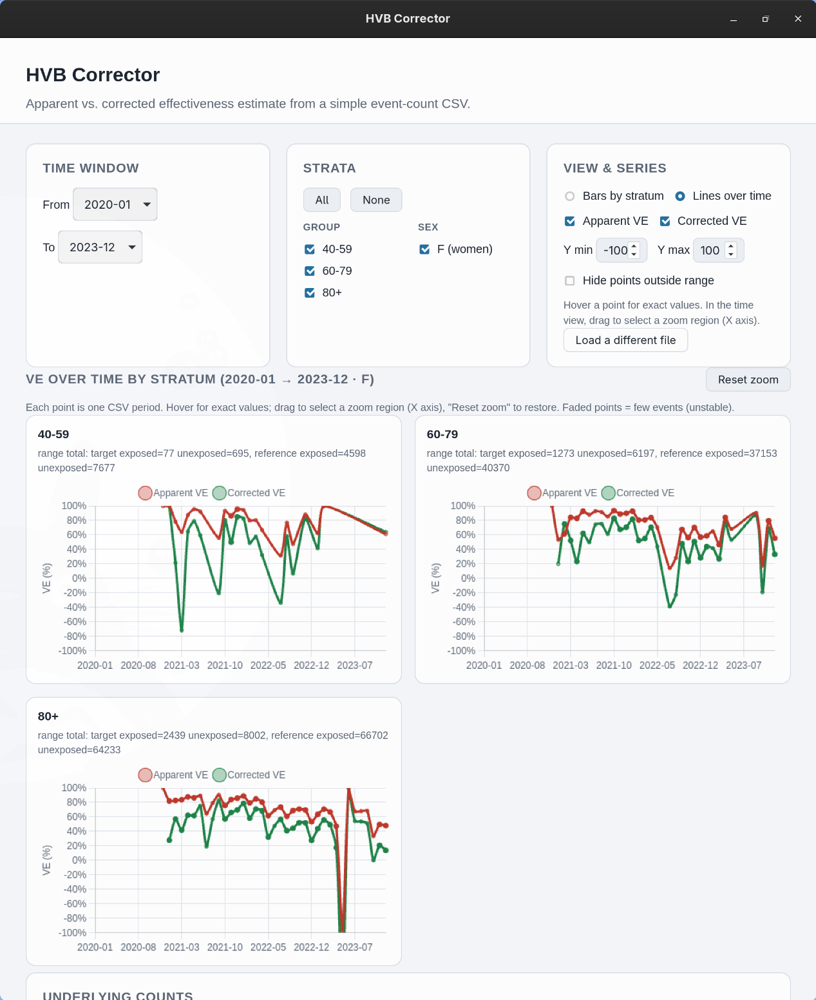

# HVB Corrector

Malý desktopový nástroj na porovnání dvou způsobů odhadu účinnosti nějaké
intervence (vakcíny, screeningového programu, čehokoliv, kde existuje jasné
rozdělení „před/po" nebo „exponovaní/neexponovaní"):

- **Zjevná (naivní) účinnost** — odhad, který vyjde z přímého porovnání
  míry událostí mezi exponovanou a neexponovanou skupinou.
- **Korigovaná účinnost** — odhad, který opravuje konkrétní, dobře
  popsané zkreslení („healthy-vaccinee" / „healthy-user" efekt), které
  zjevnou účinnost nadhodnocuje, pokud je exponovaná skupina v průměru
  zdravější než neexponovaná z důvodů, které s intervencí samotnou
  nesouvisí.

Aplikace za vás nedělá žádnou další statistiku nad rámec téhle jedné
korekce — vezme počty událostí, které už máte, spočítá oba odhady pro
každé časové období a podskupinu, a nechá vás je porovnat na grafu.

**Pro běžné použití nepotřebujete programování ani příkazovou řádku.**
Všechny kroky níže se skládají jen ze stažení souboru a jeho spuštění
dvojklikem.

## Co aplikace zobrazuje

Po nahrání CSV souboru (viz níže) uvidíte:

- **Graf** zjevné vs. korigované účinnosti, buď
  - jako **sloupce**, jeden za podskupinu, pro období, které si vyberete, nebo
  - jako **čáry v čase**, jeden bod za každé období ve vašich datech.
- **Tabulku** pod grafem se surovými počty za každým číslem, takže vždy
  vidíte přesně, z čeho každý odhad vznikl.
- Filtry na **časové okno**, **pohlaví** (F/M) a **podskupinu** (např.
  věkové pásmo), abyste se mohli podívat jen na populaci, která vás
  zajímá.
- Varovnou vlajku (⚠) u bodů s velmi malým počtem událostí — tato čísla
  jsou reálná, ale statisticky nestabilní, proto jsou označená, ne
  skrytá.



*(Skutečný snímek obrazovky s přiloženými [ukázkovými daty](../example_data/sample.csv))*

## Instalace

Přejděte na **[stránku Releases](https://github.com/ROGR3/HVB-Corrector-App/releases/latest)**
a stáhněte soubor pro váš systém. Nic dalšího není potřeba.

- **Windows:** na stránce Releases jsou dva soubory `.exe`:
  - **`hvb-corrector-app_windows_x64.exe`** (samostatný) — dvojklikem spustíte, žádná
    instalace potřeba. Zkuste tento první.
  - **`HVB.Corrector_0.1.2_x64-setup.exe`** (instalátor) — použijte jen
    pokud se samostatný soubor nespustí (obvykle chybí runtime WebView2;
    instalátor ho automaticky stáhne a nainstaluje). Přidá „HVB Corrector"
    do nabídky Start.

  V obou případech vás Windows SmartScreen nejspíš varuje před
  „neznámou aplikací", protože aplikace není podepsaná certifikátem —
  klikněte na **Další informace → Spustit přesto**.
- **Linux:**
  - **Debian/Ubuntu a odvozené distribuce:** stáhněte soubor `.deb` a
    nainstalujte ho (dvojklikem, nebo `sudo apt install ./HVB.Corrector_*.deb`).
  - **Jiná distribuce Linuxu:** stáhněte soubor `.AppImage`, označte ho
    jako spustitelný (pravé tlačítko → Vlastnosti → Oprávnění → „Povolit
    spouštění souboru jako programu", nebo `chmod +x HVB.Corrector_*.AppImage`)
    a spusťte dvojklikem.

Vaše data se **nikam neodesílají**. Aplikace běží celá jen na vašem
počítači a čte pouze soubor, který sami vyberete.

## Vyzkoušení bez vlastních dat

Pokud ještě nemáte připravené CSV, můžete aplikaci vyzkoušet na
reálných, agregovaných datech z českého veřejného zdravotnictví, která
jsou součástí zdrojového kódu: stáhněte si
[`example_data/sample.csv`](../example_data/sample.csv) z tohoto
repozitáře a nahrajte ho tlačítkem „Choose CSV file…" v aplikaci.

## Použití vlastních dat

Aplikace čte jeden CSV soubor. Každý řádek je jeden počet pro jednu
kombinaci **časového období, podskupiny, pohlaví a expoziční skupiny**.

| Sloupec | Povinný | Význam |
| --- | --- | --- |
| `period` | ano | Časové období ve formátu `YYYY-MM` (např. `2021-03`) |
| `stratum` | ano | Libovolná podskupina, kterou chcete sledovat zvlášť, např. věkové pásmo `60-79`. Používejte stejné označení důsledně; pokud podskupiny nechcete, dejte všem stejné jedno označení. |
| `sex` | ano | `F` nebo `M` |
| `group` | ano | `exposed` nebo `unexposed` — na kterou stranu intervence počty v tomto řádku patří |
| `target_events` | ano | Počet sledovaných událostí (např. úmrtí, nákaz) v tomto řádku |
| `reference_events` | ano | Počet *jiných* událostí u stejných lidí, použitých jen jako referenční/kontrolní počet pro korekci (např. úmrtí z nesouvisející příčiny, nebo párovaná kontrolní událost) |
| `population` | ne | Počet lidí, ze kterých počty v tomto řádku pocházejí. Nepovinné — potřebné jen pro zjevný odhad; korigovaný odhad tento údaj nepoužívá. |

Příklad (ženy, věkové pásmo 60-79, jedno období, obě expoziční skupiny):

```csv
period,stratum,sex,group,target_events,reference_events,population
2021-03,60-79,F,exposed,12,340,50000
2021-03,60-79,F,unexposed,45,210,30000
```

Praktické poznámky:

- Jeden řádek na kombinaci `(period, stratum, sex, group)`. Pokud máte
  pro stejnou kombinaci víc surových řádků, není to problém — aplikace
  je sečte.
- `target_events` a `reference_events` musí být celá, nezáporná čísla.
- Pokud aplikace soubor odmítne, přesně vám napíše, který řádek a
  sloupec je problém — opravte ho a soubor nahrajte znovu.

## English version

[../README.md](../README.md)
